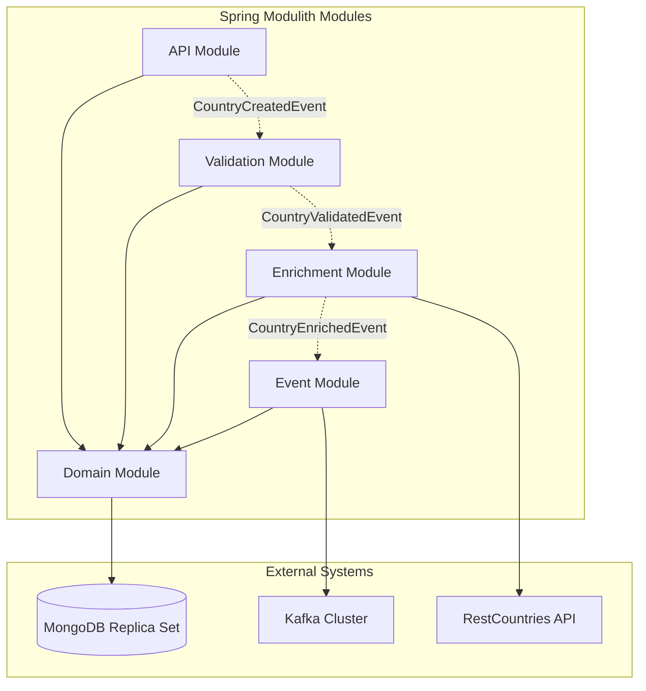
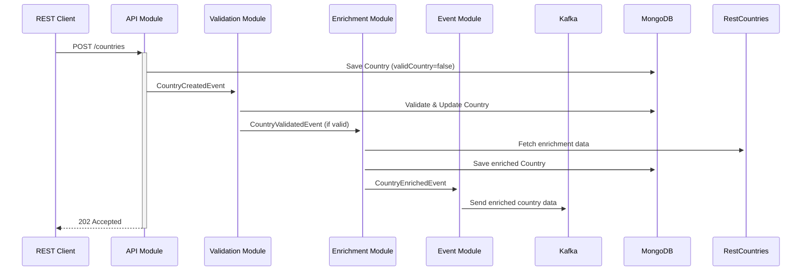

# Spring Modulith Test 1

A Spring Boot 4.0.0 application demonstrating modular architecture using Spring Modulith with event-driven communication between modules.

## Architecture

The application is organized into the following modules:

- **API Module** (`dev.neate.api`) - REST endpoints for external clients
- **Domain Module** (`dev.neate.domain`) - Core business logic and data persistence
- **Validation Module** (`dev.neate.validation`) - Country validation logic
- **Enrichment Module** (`dev.neate.enrichment`) - Country data enrichment via external APIs
- **Event Module** (`dev.neate.event`) - Kafka event production

### Module Architecture Diagram



### Event Flow Diagram



## Features

- ✅ REST API for creating countries
- ✅ MongoDB persistence with Spring Data
- ✅ Event-driven architecture using Spring Modulith
- ✅ Automatic country validation via event listeners
- ✅ Country data enrichment from RestCountries API
- ✅ Kafka event production for enriched countries
- ✅ Modular design with clear boundaries
- ✅ Comprehensive test coverage (120 tests)

## Prerequisites

- Java 17 or higher
- Maven 3.6+
- Docker (for running MongoDB and Kafka)

## Running the Application Locally

### 1. Configure hosts file for MongoDB replica set

> **Important:** The application requires MongoDB configured as a **replica set** to support Spring Modulith's event publication feature (which uses transactions). The Spring Boot application runs on your host machine but needs to connect to MongoDB containers using hostnames that resolve to specific IP addresses.

**Add the following entries to your hosts file:**

**Windows:** `C:\Windows\System32\drivers\etc\hosts`
**macOS/Linux:** `/etc/hosts`

```text
# MongoDB replica set for Spring Modulith test application
127.0.10.1 mongo1
127.0.10.2 mongo2
127.0.10.3 mongo3
```

**Why this is needed:**
- Docker containers are bound to specific IP addresses (`127.0.10.1`, `127.0.10.2`, `127.0.10.3`)
- The application configuration uses hostnames (`mongo1`, `mongo2`, `mongo3`) for the replica set
- Your hosts file maps these hostnames to the container IP addresses
- This allows the Spring Boot app to resolve MongoDB replica set members correctly

**Alternative approaches:**
1. Run the Spring Boot application inside Docker on the same network
2. Use localhost ports (27017, 27018, 27019) instead of hostnames (This doesn't work well with a replica set)
3. Assign static IPs to containers and use IP addresses directly in configuration

### 2. Start backing services

To bring up the application dependencies:

```sh
docker-compose up -d
```

**Note:** Tests use Testcontainers which automatically start Kafka and Mongo, so this is only needed for local development.

### 3. Start the Application

Run the Spring Boot application using Maven:

```bash
mvn spring-boot:run
```

The application will start on `http://localhost:8080`

### 4. Test the API

Create a country using the REST API:

**PowerShell:**
```powershell
Invoke-WebRequest -Uri http://localhost:8080/countries -Method POST -Headers @{"Content-Type"="application/json"} -Body '{"name": "United Kingdom", "code": "GB"}'
```

**Bash/curl:**
```bash
curl -X POST http://localhost:8080/countries \
  -H "Content-Type: application/json" \
  -d '{"name": "United Kingdom", "code": "GB"}'
```

Expected response: `202 Accepted`

### 5. Verify Data in MongoDB

Check the saved countries in MongoDB:

```bash
docker exec mongodb mongosh country-db --quiet --eval "db.countries.find().pretty()"
```

## Configuration

The application can be configured via environment variables:

- `MONGODB_URI` - MongoDB connection URI (default: `mongodb://mongo1:27017,mongo2:27017,mongo3:27017/?replicaSet=rs0`)
- `MONGODB_DATABASE` - Database name (default: `country-db`)
- `KAFKA_BOOTSTRAP_SERVERS` - Kafka bootstrap servers (default: `localhost:9092`)

### Spring Modulith Event Retry Configuration

Additional configuration options for Spring Modulith event processing:

- `spring.modulith.events.republish-outstanding-events-on-restart` - Enable automatic retry on startup (default: `true`)
- `spring.modulith.events.retry-scheduled` - Enable scheduled retry for stuck events (default: `false`)
- `spring.modulith.events.retry-interval` - Scheduled retry interval in milliseconds (default: `300000`)
- `spring.modulith.events.completion-mode` - Event completion tracking mode (default: `UPDATE`)

## Running Tests

Run all tests:

```bash
mvn test
```

Run a specific test class:

```bash
mvn test -Dtest=CountryControllerTest
```

**Note:** Tests use Testcontainers to automatically start MongoDB and Kafka, so Docker must be running.

## API Endpoints

### Create Country

**POST** `/countries`

Creates a new country and triggers asynchronous validation.

**Request Body:**
```json
{
  "name": "United Kingdom",
  "code": "GB"
}
```

**Response:** `202 Accepted` (no body)

**Process Flow:**
1. Country is created with `validCountry=false`
2. `CountryCreatedEvent` is published
3. Validation module listens to the event
4. Country is validated (name and code must not be null/empty)
5. If valid: `validCountry` is set to `true` and `CountryValidatedEvent` is published
6. Enrichment module listens to `CountryValidatedEvent`
7. Country data is enriched from RestCountries API (population, currency, language)
8. `CountryEnrichedEvent` is published
9. Event module listens to `CountryEnrichedEvent`
10. Enriched country data is sent to Kafka topic `country-events`

**Events Published:**
- `CountryCreatedEvent` - Contains the ID of the newly created country
- `CountryValidatedEvent` - Published only if validation passes
- `CountryEnrichedEvent` - Published after successful enrichment

**Kafka Topics:**
- `country-events` - Enriched country data in JSON format

## Event Retry Configuration

Spring Modulith 2.0.0 provides automatic retry mechanisms for failed events using the Event Publication Registry (MongoDB).

### Automatic Retry on Startup

Enable automatic retry of incomplete events when the application starts:

```yaml
spring:
  modulith:
    events:
      republish-outstanding-events-on-restart: true
```

### Scheduled Retry

For production environments, you can enable scheduled retry of stuck events:

```yaml
spring:
  modulith:
    events:
      retry-scheduled: true
      retry-interval: 300000  # 5 minutes (default)
```

**Implementation Note:** The application includes a `ScheduledEventRetryService` component that can be enabled via the `spring.modulith.events.retry-scheduled=true` property. This service runs every 5 minutes and retries events that have been incomplete for more than 1 minute.

### Manual Retry (Optional)

For administrative control, you could implement a REST controller to manually trigger retries:

```java
@RestController
@RequestMapping("/admin/events")
public class EventRetryController {
    
    @PostMapping("/retry")
    public ResponseEntity<?> retryEvents(@RequestParam(defaultValue = "5") int olderThanMinutes) {
        // Manually retry events older than specified minutes
        retryService.manuallyRetryEvents(Duration.ofMinutes(olderThanMinutes));
        return ResponseEntity.ok(Map.of("status", "completed"));
    }
}
```

This would provide endpoints like:
- `POST /admin/events/retry?olderThanMinutes=5` - Retry events older than 5 minutes
- `POST /admin/events/retry-all` - Retry all incomplete events

### Monitoring

Event retry attempts are logged at DEBUG/INFO levels. Monitor logs for:
- `Starting scheduled retry of incomplete events`
- `Manual retry requested for events older than X minutes`
- `Error during scheduled event retry`

## Development

### Project Structure

```
src/
├── main/
│   └── java/
│       └── dev/neate/
│           ├── ScheduledEventRetryService.java  # Spring Modulith event retry service
│           ├── Application.java                 # Main application class
│           ├── api/                              # REST controllers and DTOs
│           ├── domain/                           # Domain entities and services
│           │   └── internal/                     # Internal implementation details
│           ├── validation/                       # Validation events and logic
│           │   └── internal/                     # Internal validation services
│           ├── enrichment/                       # Enrichment events and logic
│           │   └── internal/                     # Internal enrichment services
│           └── event/                            # Kafka event production
│               └── internal/                     # Internal Kafka producers
└── test/
    └── java/
        └── dev/neate/
            ├── api/                              # API layer tests
            ├── domain/                           # Domain layer tests
            ├── validation/                       # Validation layer tests
            ├── enrichment/                       # Enrichment layer tests
            ├── event/                            # Event layer tests
            ├── MongoTestcontainersConfiguration.java    # MongoDB Testcontainers config
            ├── KafkaTestcontainersConfiguration.java   # Kafka Testcontainers config
            └── application.yaml                 # Test configuration
```

### Adding New Modules

📖 **See [MODULE_GUIDE.md](MODULE_GUIDE.md) for a complete guide on adding new modules with examples**

The guide includes:
- Step-by-step module creation with concrete Notification Module example
- Spring Modulith event patterns and best practices
- Testing strategies for new modules (unit + integration tests)
- Common pitfalls and troubleshooting tips
- Complete code examples from package structure to implementation

### Spring Boot 4.0.0 Notes

This project uses Spring Boot 4.0.0 which has updated package structures:

- `@WebMvcTest`: `org.springframework.boot.webmvc.test.autoconfigure.WebMvcTest`
- `@MockitoBean`: `org.springframework.test.context.bean.override.mockito.MockitoBean`
- Spring Data MongoDB: `org.springframework.data.mongodb.*`

## Stopping the Application

1. Stop the Spring Boot application: `Ctrl+C`
2. Stop and remove the containers:
   ```bash
   # Stop Kafka
   docker stop kafka
   
   # Stop MongoDB replica set
   docker stop mongo1 mongo2 mongo3
   
   # Remove network
   docker network rm mongoCluster
   ```

## Documentation

- [Tasks](docs/tasks.md) - Detailed task breakdown
- [Tracker](docs/tracker.md) - Implementation progress tracking
